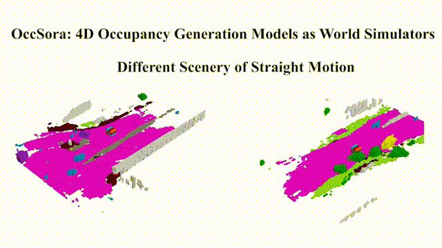

# OccSora: 4D Occupancy Generation Models as World Simulators for Autonomous Driving

### [Paper](https://arxiv.org/)  | [Project Page](https://wzzheng.net/OccSora) 


> OccSora: 4D Occupancy Generation Models as World Simulators for Autonomous Driving

> [Lening Wang](https://github.com/LeningWang)*, [Wenzhao Zheng](https://wzzheng.net/)\* $\dagger$, [Yilong Ren](https://shi.buaa.edu.cn/renyilong/zh_CN/index.htm), [Han Jiang](https://scholar.google.com/citations?user=d0WJTQgAAAAJ&hl=zh-CN&oi=ao), [Zhiyong Cui](https://zhiyongcui.com/), [Haiyang Yu](https://shi.buaa.edu.cn/09558/zh_CN/index.htm), [Jiwen Lu](http://ivg.au.tsinghua.edu.cn/Jiwen_Lu/)

\* Equal contribution $\dagger$ Project leader

With trajectory-aware 4D generation, OccSora has the potential to serve as a world simulator for the decision-making of autonomous driving.


## News

- **[2024/05/31]** Training, evaluation, and visualization code release.
- **[2024/05/31]** Paper released on [arXiv](https://arxiv.org/abs/2405.).


## Demo

### Trajectory-aware Video Generation:


### Scene Video Generation:



## Overview


Different from most existing world models which adopt an autoregressive framework to perform next-token prediction, we propose a diffusion-based 4D occupancy generation model, OccSora, to model long-term temporal evolutions more efficiently. We employ a 4D scene tokenizer to obtain compact discrete spatial-temporal representations for 4D occupancy input and achieve high-quality reconstruction for long-sequence occupancy videos. We then learn a diffusion transformer on the spatial-temporal representations and generate 4D occupancy conditioned on a trajectory prompt. OccSora can generate 16s-videos with authentic 3D layout and temporal consistency, demonstrating its ability to understand the spatial and temporal distributions of driving scenes.


## Getting Started

### Installation
1. Create a conda environment with Python version 3.8.0

2. Install all the packages in environment.yaml

3. Please refer to [mmdetection3d](https://mmdetection3d.readthedocs.io/en/latest/getting_started.html#installation) about the installation of mmdetection3d

### Preparing
1. Create a soft link from data/nuscenes to your_nuscenes_path

2. Prepare the gts semantic occupancy introduced in [Occ3d]

3. Download the generated [train/val pickle files]( https://github.com/wzzheng/TPVFormer/tree/main) and put them in data/

    [nuscenes_infos_train_temporal_v3_scene.pkl]

    [nuscenes_infos_val_temporal_v3_scene.pkl]

  The dataset should be organized as follows:

```
OccSora/data
    nuscenes                 -    downloaded from www.nuscenes.org
        lidarseg
        maps
        samples
        sweeps
        v1.0-trainval
        gts                  -    download from Occ3d
    nuscenes_infos_train_temporal_v3_scene.pkl
    nuscenes_infos_val_temporal_v3_scene.pkl
```

### Training
Train the VQVAE on A100 with 80G GPU memory.
```
python train_1.py --py-config config/train_vqvae.py --work-dir out/vqvae
```
Generate training Token data using the vqvae results
```
python step02.py --py-config config/train_vqvae.py --work-dir out/vqvae
```
Train the OccSora on A100 with 80G GPU memory. 
```
torchrun --nnodes=1 --nproc_per_node=8 train_2.py --model DiT-XL/2 --data-path /path
```
### Evaluation
Evaluate the model on A100 with 80G GPU memory.  

The token is obtained by denoising the noise samples_array.npy
```
python sample.py --model DiT-XL/2 --image-size 256 --ckpt "/results/001-DiT-XL-2/checkpoints/1200000.pt"
```
### Visualization


```
python visualize_demo.py --py-config config/train_vqvae.py --work-dir out/vqvae
```

## Related Projects

Our code is based on [OccWorld](https://github.com/wzzheng/OccWorld) and [DiT](https://github.com/facebookresearch/DiT). 

Also thanks to these excellent open-sourced repos:
[TPVFormer](https://github.com/wzzheng/TPVFormer) 
[MagicDrive](https://github.com/cure-lab/MagicDrive)
[BEVFormer](https://github.com/fundamentalvision/BEVFormer)

## Citation

If you find this project helpful, please consider citing the following paper:
```
  @article{wang2024occsora,
    title={OccSora: 4D Occupancy Generation Models as World Simulators for Autonomous Driving},
    author={Wang, Lening and Zheng, Wenzhao and Ren, Yilong and Jiang, Han and Cui, Zhiyong and Yu, Haiyang and Lu, Jiwen},
    journal={arXiv preprint arXiv:2405.},
    year={2024}
	}
```